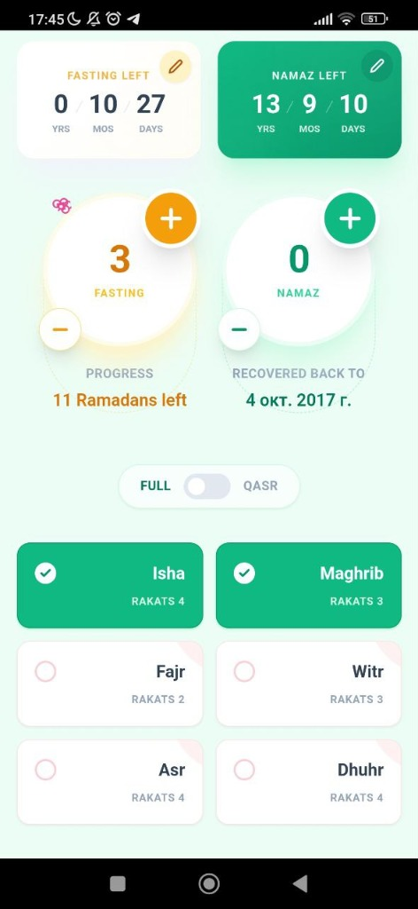

# 🌙 Qaza Tracker

<p align="center">
  
</p>

**Qaza Tracker** is a modern, beautiful, and completely offline application for tracking and completing missed (qaza) prayers and fasting.

## 📱 Visual Interface
<p align="center">
  
</p>

## 💡 Concept
The application helps Muslims organize the process of fulfilling worship debts. The main feature is progress visualization: as you complete tasks in the app, trees and flowers "grow," providing positive motivation.

## 🚀 Key Features
- **Prayer:** Track Fajr, Dhuhr, Asr, Maghrib, Isha, and Witr.
- **Fasting:** Manage Ramadan debts and individual missed days.
- **Flexibility:** Support for shortened (qasr) prayers for travelers.
- **Privacy:** All data is stored locally (LocalStorage). No cloud storage or data collection.
- **Backup:** Ability to export and import data in JSON format.

## 🛠 Tech Stack
- **Frontend:** React 19, TypeScript, Vite.
- **Styling:** Tailwind CSS.
- **Mobile:** Capacitor 7 (Android).
- **Icons:** Custom SVG.

## 📦 Dependencies & Requirements
- **Node.js:** v18 or higher.
- **npm:** Included with Node.js.
- **Android Studio:** For building and running on Android devices (requires SDK 34+).

## 📥 How to Build and Run

### 1. Install Dependencies
```bash
npm install
```

### 2. Run in Development Mode
```bash
npm run dev
```

### 3. Build for Android
```bash
# Build the web part and sync with the Android project
npm run build:android

# Open the project in Android Studio for the final APK build
npx cap open android
```

## 📜 License
This project is open-source and free for the Muslim community.

